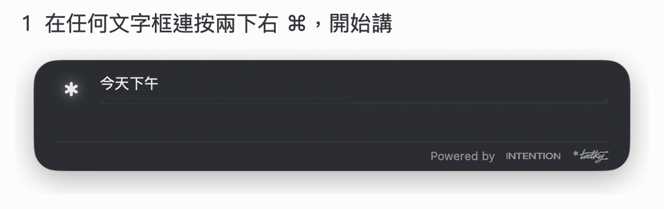
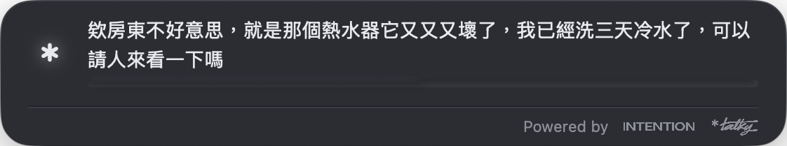
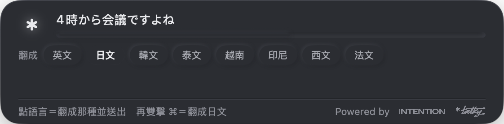
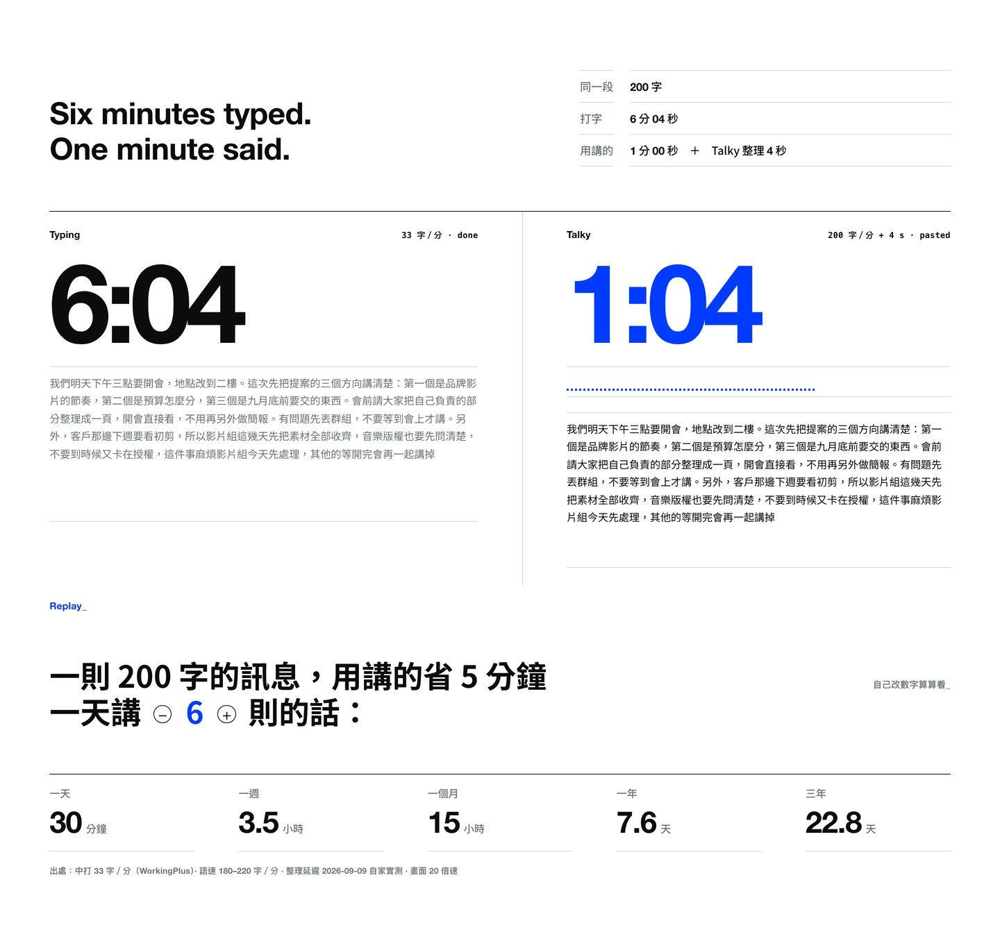
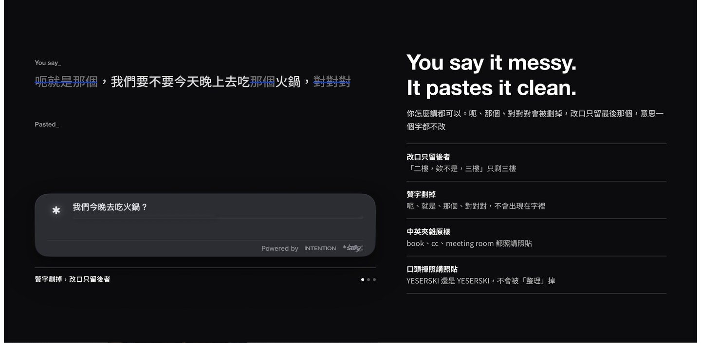

<p align="center">
  
</p>

# Talky

**Mac 上的繁體中文語音輸入法。在任何文字框連按兩下右 ⌘、講一句話，整理好的書面繁中直接貼進游標。**

聲音不出你的電腦。要不要把逐字稿交給 AI 整理、交給哪一個，你自己決定。

[English](README.en.md)

<p align="center">
  <a href="https://github.com/intentionltd888/talky/releases/latest/download/Talky.dmg"><b>下載 Talky.dmg</b></a>
  ・ 免費、開源（MIT）・ Apple 晶片的 Mac、macOS 14 以上
</p>

<p align="center">
  <a href="https://github.com/intentionltd888/talky/releases"></a>
</p>

<p align="center">
  
</p>

---

## 三步

1. 在任何文字框（備忘錄、瀏覽器、LINE、終端機）**連按兩下右 ⌘**。螢幕下方出現面板，邊講邊出字。
2. 講完**再按一次**。面板寫「整理中」。
3. 整理好的字**貼進游標處**，面板寫「已貼上」，然後自己消失。

講到一半講錯，直接說「啊不對，是……」，整理時只會留改口後的版本。
貼不進去的地方（例如密碼欄）會改成放進剪貼簿，面板會告訴你按 ⌘V。

<p align="center">
  
</p>

## 為什麼做這個

市面上的 Mac 聽寫工具幾乎都以簡體中文或英文為第一語言，中英夾雜的句子常被「順手翻譯」掉。Talky 的三個前提剛好相反：

1. **繁體中文（台灣用字）是第一語言**，不是某個語言包。
2. **中英夾雜保持原樣**。「這個 implementation 很 elegant」就是這樣，不會變成「這個實作非常優雅」。
3. **台灣的輸入環境**：注音輸入法開著、瀏覽器、終端機、各種 Electron app，都要貼得進去。

## 隱私：聲音不出電腦

- **語音辨識全部在你的 Mac 上跑**（whisper.cpp，模型 whisper large-v3-turbo，約 1.5GB，第一次啟動時下載，之後離線也能用）。錄音不會上傳到任何地方。
- **會離開電腦的只有一樣東西：辨識出來的文字**，而且只在你選了雲端整理的時候，送去你自己的 AI 帳號。選內建模型就什麼都不出去。
- 對外連線只有兩種：下載模型（HuggingFace 直連，SHA256 內建在程式裡比對）、你選的整理服務。**沒有遙測、沒有帳號、沒有更新檢查。**
- 呼叫外部整理工具時帶著完整隔離：不給任何工具、不讀你的專案設定、在一個空的中性目錄裡跑、環境變數剝掉。它只做一件事：把這一句口語整理成書面中文。
- 你填的 API 金鑰（如果有）只存在 macOS 鑰匙圈；匯出的診斷檔不含金鑰。

## 用什麼整理（相容說明）

「整理」＝把口語變書面：去贅字、修改口、繁體化、全形標點。第一次打開的精靈會替你選好；之後在「設定 → 進階」隨時換。

| 選項 | 逐字稿去哪裡 | 相容 |
|---|---|---|
| **用你自己的 AI 訂閱**（建議） | 送到你的帳號，算你自己的額度，Talky 不經手 | Claude Code（Pro／Max 訂閱）、ChatGPT 桌面版或 Codex CLI（Plus／Pro 訂閱）。沒裝的話 Talky 會在 app 裡幫你裝好、開瀏覽器讓你登入、登入完自動綁定，不用開終端機 |
| **內建本機模型**（不用帳號） | 哪裡都不去 | Qwen3-4B，2.5GB 自動下載；建議 12GB 以上記憶體 |
| **Ollama** | 本機 | 任何 Ollama 模型，預設 `qwen3:4b` |
| **自填端點** | 你填的那個 | OpenAI 相容 chat/completions、Anthropic Messages API（按量計費，金鑰進鑰匙圈） |
| **不整理** | 哪裡都不去 | 只做繁體化與標點，直接貼原稿 |

退路是有順序的：雲端失敗（沒登入、逾時）→ 自動退本機模型（若有）→ 再不行就貼原稿。**不會靜默假裝成功**：走了哪一條，面板上看得到。

## 翻譯模式：講中文、貼外語

**左 ⌘ 連按兩下**進翻譯模式。講完再雙擊任一顆 ⌘，就翻成面板上亮著的那種語言；或直接點面板上的語言籤，點哪種就翻成哪種並立刻送出。每個 app 會記住你上次對它用的語言。

核心八種：英、日、韓、泰、越南、印尼、西班牙、法；設定裡可以多開德、葡（巴西）、簡體中文、粵語書面。
敬語不用一種一種選：在設定裡選一次**對象**（朋友／同事／不認識的人），日文的です・ます、韓文的해요體、法文的 tu／vous 就跟著對；泰文的句尾 ครับ／ค่ะ 另外設一次性別。

<p align="center">
  
</p>

## 官網介紹頁

完整介紹在 [intentionltd888.github.io/made/talky](https://intentionltd888.github.io/made/talky/)：快多少、講得亂貼得乾淨、翻譯模式、聲音怎麼留在電腦裡、常見問題。

<p align="center">
  <a href="https://intentionltd888.github.io/made/talky/#speed"></a>
  <a href="https://intentionltd888.github.io/made/talky/#rules"></a>
  <a href="https://intentionltd888.github.io/made/talky/#translate"></a>
</p>

## 安裝

1. [下載 Talky.dmg](https://github.com/intentionltd888/talky/releases/latest/download/Talky.dmg)，打開，把 Talky 拖進 Applications；或直接雙擊 DMG 裡的 Talky，它會自己放進「應用程式」、加進 Dock、然後打開。DMG 經 Developer ID 簽名與 Apple 公證，不會有安全警告。
2. 從 Applications 打開 Talky。第一次會跑五步精靈：麥克風 → 輔助使用 → 整理方式 → 試講一句 → 好了。要親手做的只有：按「允許」、去系統設定開一個開關、講一句話。
3. **輔助使用不能跳**：沒開，連按右 ⌘ 完全不會有反應（偵測快捷鍵、把字貼進別的 app 都要它）。開完 app 會在 2 秒內自己接上。

需求：Apple 晶片（M1 以上）、macOS 14 以上。Intel Mac 不支援：聽寫模型在 CPU 上一句要十秒以上，做出來也不能用。

**想叫 AI 幫你裝**：設定 → 進階最上面有一段話，複製貼給你自己的 AI，它會照隨 app 安裝的 [AGENTS.md](AGENTS.md) 一步一步帶你，最後驗收＝你親手連按兩下右 ⌘。
終端機派：`bash scripts/setup.sh` 一鍵備齊環境。

這台電腦如果裝過同一家的會議記錄 app，Talky 會借用它已經下載好的語音模型與常用詞，不讓你為了同樣的檔案再下載 1.5GB。借用邏輯全部集中在 `app/Sources/SharedPaths.swift`，就那一個檔，想拔掉很容易。

## 從原始碼建置

```bash
xcode-select --install          # 第一次
bash scripts/vendor-fetch.sh    # 準備語音／整理引擎（找得到現成的就複製，否則從源碼編，10–20 分鐘）
bash build.sh                   # 產出 build/Talky.app
open build/Talky.app
```

- 沒有 Xcode 專案檔，就是 `swiftc app/Sources/*.swift` 一發；`vendor/`（引擎二進位）與 `build/`（產物）都不進 git。
- 引擎用固定版本（`bash scripts/vendor-build.sh`），行為不會隨著你電腦上裝了什麼而飄移。
- 簽名：這台有 Developer ID 憑證就自動用它，沒有才退 **ad-hoc**。ad-hoc 的代價是每次重編之後，系統設定裡的「輔助使用」看起來是開的、對新版卻無效（macOS 認不出「這是同一個 app」）；精靈第 2 步有一顆「清掉舊記錄再開一次」處理這件事。指定憑證：`TALKY_SIGN_ID="Apple Development: 你的名字 (XXXXXXXXXX)" bash build.sh`。
- 給別人用的安裝檔：`bash scripts/make-dmg.sh` 打 DMG，`bash scripts/notarize.sh` 送 Apple 公證＋釘票。
- 公開前的清洗掃描：`bash scripts/check-clean.sh` 要綠燈。

## 命令列

```bash
/Applications/Talky.app/Contents/MacOS/Talky --doctor
# 麥克風／輔助使用／模型／整理服務登入狀態／Talky 在不在跑／快捷鍵在不在聽／port 一次看完

/Applications/Talky.app/Contents/MacOS/Talky --ime-polish "呃就是那個我們明天下午三點要開會嘛,對對對"
# 不開 UI、不收音，直接跑整理路由並印出結果與實際走的那一條
```

引擎的 port 是 `127.0.0.1:8932`（語音）與 `127.0.0.1:8947`（本機整理），只綁 localhost。

## 你的東西放哪

| 東西 | 位置 |
|---|---|
| 模型 | `~/Library/Application Support/Talky/models/` |
| 常用詞 | `~/Library/Application Support/Talky/glossary.txt` |
| 備忘錄（最近 20 句口述，點 Dock 圖示看） | 本機 `UserDefaults`，不出機器 |
| 記錄檔 | `~/Library/Logs/Talky/talky.log` |
| 設定 | `defaults read ltd.intention.talky` |

## 還沒做的

老實列出來，免得你以為是壞掉：

- 邊講邊出字目前是每 1.4 秒重轉最後 45 秒；**VAD 切句**還沒進來，所以長口述放開之後還要等一段整段重轉的時間。
- 「檢查有沒有新版」與自動更新（Sparkle）。新版目前直接發新的 DMG。
- 任意組合鍵錄製（「重設快捷鍵」只有右 ⌘／右 ⌥／fn 三選一）。
- Homebrew cask、GitHub Actions 自動打包。
- 貼字目前是「合成 ⌘V＋還原剪貼簿」一種做法；原生欄位直接插入還沒做。
- 合上螢幕之後 macOS 會硬體切斷內建麥克風（含接外接螢幕的合蓋模式），軟體繞不過去，實測過。要合蓋講話請接外接麥克風。

## 回報問題與參與

- 出問題：設定 → 一般 → 「匯出診斷檔到桌面」，把那份 txt 附在 [issue](https://github.com/intentionltd888/talky/issues/new/choose) 裡（不含金鑰）。
- 想幫忙測：照 [TESTING.md](TESTING.md) 走一遍，25 條，每條只要「做一個動作、看一個結果」。
- 想改程式：先讀 [CONTRIBUTING.md](CONTRIBUTING.md)。

## 追蹤我們

Talky 是 [INTENTION®](https://www.intention.ltd/) 做的。想看我們在做什麼、給我們意見：

- Instagram：[@intention.ltd](https://www.instagram.com/intention.ltd)
- 官網：[intention.ltd](https://www.intention.ltd/)
- 想法與建議：[Discussions](https://github.com/intentionltd888/talky/discussions)；壞掉了開 [issue](https://github.com/intentionltd888/talky/issues/new/choose)

## 授權

程式碼 MIT，見 [LICENSE](LICENSE)。

`app/Resources/Brand/` 裡的 *talky 標準字與 INTENTION® 字標是商標，**不在 MIT 範圍內**，只供本 app 顯示自己的身份使用；細則見 [app/Resources/Brand/TRADEMARK.md](app/Resources/Brand/TRADEMARK.md)。

用到的開源專案：[whisper.cpp](https://github.com/ggml-org/whisper.cpp)（MIT）、[llama.cpp](https://github.com/ggml-org/llama.cpp)（MIT）、語音模型 whisper large-v3-turbo（MIT）、整理模型 Qwen3-4B-Instruct（Apache 2.0）。

Made by [INTENTION®](https://www.intention.ltd/), Taipei.
